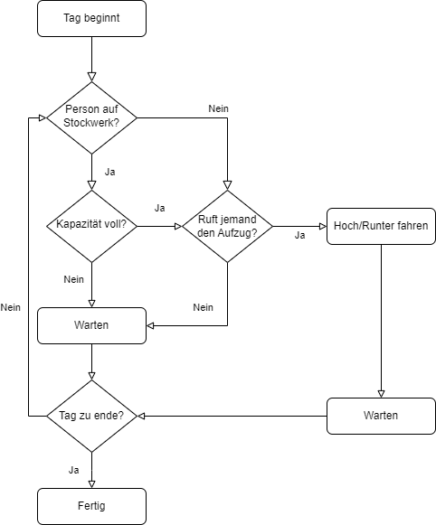

# Verhalten

## Vorbedingungen
<!-- Vorbedingungen: Was muss gegeben sein, damit das SUI funktioniert? -->

<!-- Welche Funktion repräsentiert das SUI, wie interagiert es mit anderen? -->
<!-- Fahrstuhl fahren -->

Als Vorbedingung der Simulation gelten die Eingangsparameter, die den 
Fahrstühlen ihre Eigenschaften beschreiben. 
Mit den Eigenschaften repräsentieren die Fahrstühle die Funktionen der 
Transportation der Personen auf verschiedenen Stockwerken. 
Dabei agieren sie nicht aktiv mit den Personen.

## Interne Prozesse
<!-- Internen Prozesse: Welche Prozesse laufen in dem SUI ab? -->

Die Fahrstühle folgen während der Simulation folgendem Prozessablauf.

Zum Beginn wartet ein Fahrstuhl. Hier können zwei Events eintreten. 
Eine Person möchte auf dem aktuellen Stockwerk Einsteigen oder der 
Fahrstuhl wird von einem anderen Stockwerk aus gerufen. Im zweiten 
Fall fährt der Fahrstuhl zum neuen Stockwerk und wartet eine bestimmte 
Taktzahl (standardmäßig ein Takt) ab. In dieser Zeit wird der 
Einstiegsvorgang simuliert, der auch im ersten Fall vorliegt. 
Dabei erhöht sich die Belegung um eins und das gewünschte Stockwerk wird
in die Aufgabenliste eingereiht. Nun entscheidet sich zunächst durch den 
Aufzug-Algorithmus (oder auch SCAN) entschieden, welches Stockwerk 
angefahren werden soll. Dabei gilt die Zielstockwerke der Insassen und der 
Personen, die auf die Stockwerke verteilt den Aufzug rufen. Jedoch kennt 
der Fahrstuhl nur die Richtung, in die die Personen außerhalb fahren 
möchten und nicht deren Zielstockwerk.

## Fehlermöglichkeit
<!-- Fehlermöglichkeit: Was kann schiefgehen in dem Verhalten des SUIs, wie ist darauf zu reagieren? -->
<!-- Das nicht alle Menschen bis zum Tagesende bedient wurden -->

Die Situation, dass sich am Ende des Tages noch weitere Personen im Haus 
befinden, kann als Fehler der Simulation auftauchen. Dies geschieht, wenn 
die Fahrstühle zu wenige Personen bedienen konnten. Jedoch lässt sich dies 
auch auf ein zu hohes Personenaufkommen zurückzuführen. Diese Situation 
tritt vor allem dann auf, wenn selbst das optimale Verhalten der 
Fahrstühle nicht ausreicht, um sämtliche Personen zu transportieren.

Daher wird sich für die spätere Optimierung mittels Reinforcement 
Learning auf den Personenandrang zurückgegriffen, die bereits der 
Aufzug-Algorithmus bewältigen konnte.

## Nachbedingung
<!-- Nachbedingung: Was ist bekannt, wenn die Simulation beendet ist? -->
<!-- Haus ist leer -->

Nach dem Abschluss der Simulation muss als Nachbedingung ein leeres 
Gebäude folgen. Keine Person sollte sich noch darin aufhalten.