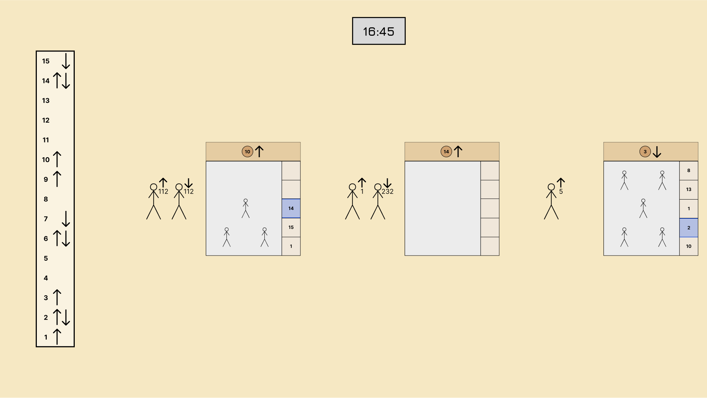

# Identität

<!-- Wie heißt das Modell? -->
<!-- Fahrstuhl -->

Im Rahmen der Vorlesung "Simulation and Reinforcement Learning" sollen drei Fahrstühle eines
Bürogebäudes simuliert und anschließend ihre Funktion mittels Reinforcement Learning optimiert werden. 

<!-- \includegraphics[scale=0.2]{images/Fahrstuhl.png} -->

<!-- Was sind die Grenzen des Modells? -->
<!-- Wie weit modellieren -->
Hierfür wird die Simulation auf einen groben Detailgrad heruntergebrochen. Die Grenzen der Simulation werden in den
nachfolgenden Kapiteln genauer beleuchtet.