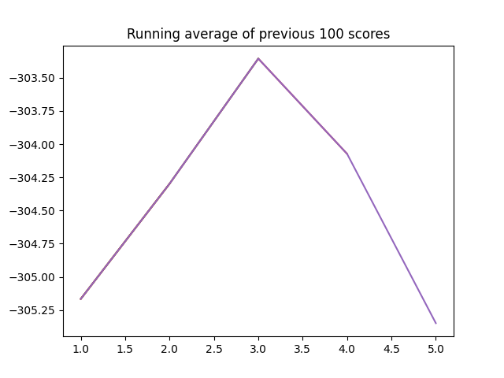
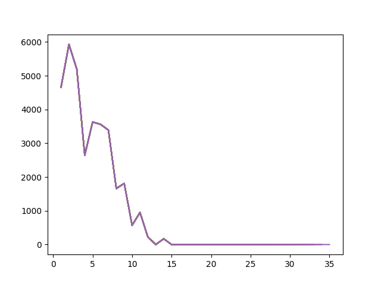

# Trainingsergebnisse nach Zombie Dice

Nach dem ersten Trainingsprozess erreichte das Netz nach Zombie-Dice eine durchschnittliche Wartezeit von 955 Takten und
alle Personen verbleiben im Gebäude. Als Reward wurde die durchschnittliche Wartezeit als negativer Wert übergeben.
Wie in Abbildung \ref{img_train_dice_neg} zu sehen, viel die Leistung des Netzes jedoch schnell.

Daher wurde der Reward zu einem positiven Wert für Einstiege und doppelter Wert für
Ausstiege von Passagieren vergeben. Dadurch wurde eine durchschnittliche Wartezeit von 897 Takten und alle
Personen verbleibend im Gebäude erreicht. Die Abbildung \ref{img_train_dice} zeigt, wie nach 35 Iterationen erneut
die Leistung kurz stieg, aber schnell wieder abfiel. Daher wurde die Implementierung nach Neuralnet weiterverwendet.

