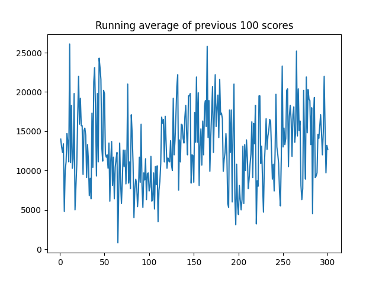

# Trainingsergebnisse nach Neuralnet

Nach dem Trainingsprozess nach Neuralnet erreichte das Netz eine durchschnittliche Wartezeit von 876 Takten und 97/100
Personen verbleibend im Gebäude. Die Abbildung \ref{img_train_phill} zeigt, dass er trotz große Schwankungen ins gesamt
wellenförmig lernt. Das Netz wird besser und fällt dann auch wieder und pendelt sich bei den oben angegebenen Werten
ein. Durch das Hinzufügen von mehreren Schichten konnte sich Ergebnis verbessern, jedoch wird sich wohl eine Anpassung
der Netze und der Reward-Funktion eine Besserung ergeben, welche aus Zeitgründen nicht weiter optimiert werden konnte.

