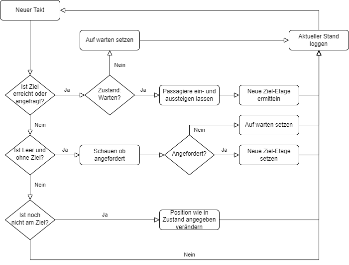

# Aufzugsmanagement Logik

Die einzelnen Aufzüge entscheiden, wann sie wohin möchten, und kommunizieren nicht untereinander.
Bei jedem neuen Takt wird geprüft, ob das aktuelle Ziel-Stockwerk erreicht wurde. Ist dies der Fall,
soll der Bewegungszustand des Aufzugs „Warten“ sein. Ansonsten wird dieser darauf gesetzt, der aktuelle
Stand geloggt und für diesen Takt beendet. Wartet der Aufzug bereits, lässt er Passagiere, die im aktuellen
Stockwerk aussteigen wollen, aussteigen und die Personen einsteigen, die in die gleiche Richtung, 
wie der Aufzug möchten. Als Nächstes wird die neue Ziel-Etage aus den Zielen der Passagiere ermittelt.

Ist der Aufzug leer und ohne Ziel, zu dem er gerufen wurde, dann scannt dieser nach einer Aufforderung. 
Dabei wird zunächst geschaut, ob in der aktuellen Richtung bis zum Rand des Gebäudes (Erdgeschoss oder oberste Etage)
gerufen wurde, und übernimmt die Etage, die am nächsten zur aktuellen Position liegt. Ansonsten wird in 
der Richtung nach der weit entfernten Forderung in die Gegengesetze Richtung gesucht. Sind in der Richtung
des Aufzugs für beide Rufrichtungen keine Aufforderung von Personen vorhanden, wechselt der Aufzug seine Richtung
und prüft dies noch einmal vollständig. Ist am Ende des Scans kein Stockwerk gefunden, in dem ein Aufzug gerufen wurde,
dann wartet der Aufzug einen weiteren Takt.

Der vorangegangene Absatz kann wie im folgenden kommentierten Codeausschnitt beschrieben, zusammengefasst werden:

- if on the way up: check if anyone from position to 14 wants to go up.
- if on the way up: check if anyone from 14 to position wants to go down.

switch direction: up -> down

- if on the way up: check if anyone from position to 0 wants to go down.
- if on the way up: check if anyone from 0 to position wants to go up.

- if on the way down: check if anyone from position to 0 wants to go down.
- if on the way down: check if anyone from 0 to position wants to go up.

switch direction: down -> up

- if on the way down: check if anyone from position to 14 wants to go up.
- if on the way down: check if anyone from 14 to position wants to go down.

Sind Fälle vom erreichten Ziel, beziehungsweise der angeforderten Etage und des leeren wartenden Aufzugs nicht erfüllt,
so wird geprüft, ob sich der Aufzug gerade am Bewegen ist. Ist dies der Fall, dann wird sich die Position in 
die jeweilige Richtung bewegt.

