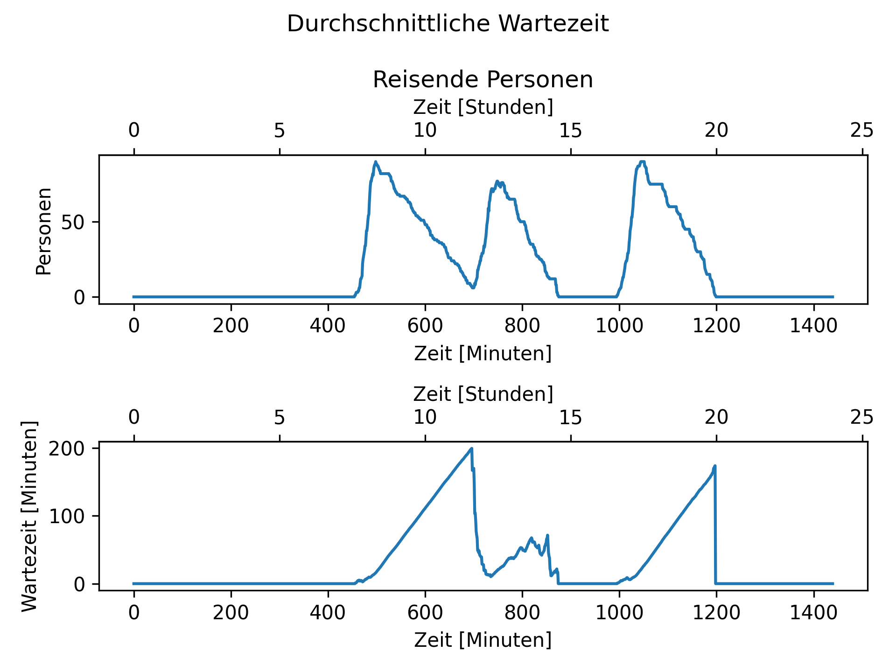

# Simulationsübersicht

Die Simulation wurde in Python realisiert und anhand des Conceptual Model gestaltet.
In den nächsten Kapiteln wird der implementierte Ablauf der Logik der Simulation erläutert. 

Die Klasse Simulation selbst initialisiert Personen- und Aufzugsmanagement und führt
in einer „run“-Methode diese taktweise aus. Dabei wird am Ende eines Taktes die generierten
Logs zusammengeführt und in einer CSV-Datei gespeichert.

Am Ende des Tages wird eine Statistik erstellt, welche in eine CSV-Datei gespeichert wird,
in der jede Zeile ein simulierter Tag entspricht.

Durch das intensive Logging soll im späteren Teil des Reinforcement Learnings das Vergleichen
der verschiedenen Generationen erleichtern.

## Validierung der Simulation

Die Validierung der Simulation erfolgt anhand der UI, die die Zustände und Daten der Simulation visualisieren.
Dabei kann diese beschleunigt und pausiert werden. Diese ist jedoch nur dann aktiviert, wenn für das Programm ein
Flag gesetzt wurde. Dadurch kann der Reinforcement Learner später einen simulierten Tag verarbeiten, ohne verlangsamt
zu werden.

Als zweite Methode helfen die Log-Dateien, in denen jede Zeile einen Takt der Simulation repräsentieren.

Des Weiteren werden einige Daten geplottet, unter anderem die durchschnittliche Wartezeit.
Wenn diese steigt, sobald viele Menschen unterwegs sind und sinkt, wenn dies nicht der Fall ist,
so verhält die Simulation wie erwartet und bringt ein Indiz, dass diese Valide ist (\ref{avgWait}).

