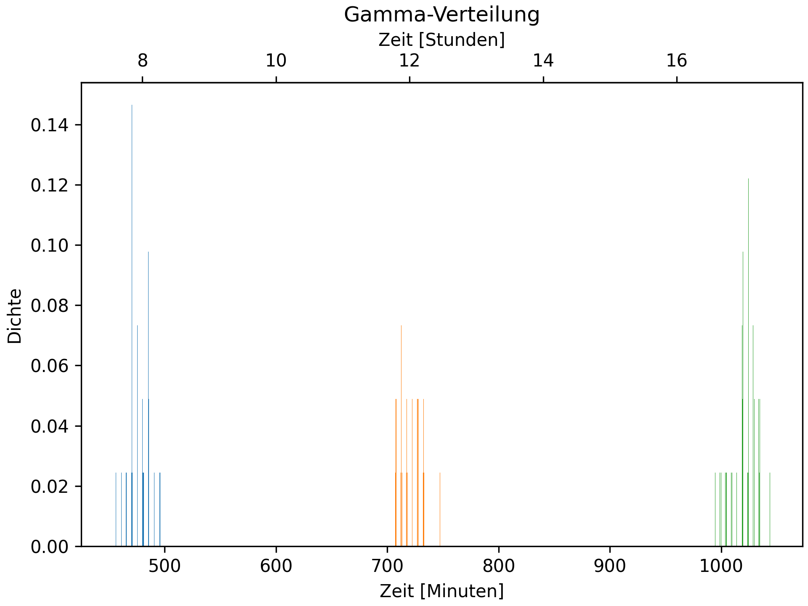

# Personenmanagement Logik

Die Personen, die im Gebäude arbeiten werden als einzelne Klasse modelliert und speichern deren aktuellen Zustand, 
wie Position, Heimat-Stockwerk und Schedule, wann sie wohin möchten.

Die Klasse „PersonManager“ generiert bei der Initialisierung sämtliche Büroarbeiter und verteilt deren 
Heimat-Stockwerke gleichverteilt über die Etage außer dem Erdgeschoss (\ref{Etagen-Verteilung}).

Anschließend wird für jede Person einen 
Schedule aus Tupeln von wann und wohin sie müssen generiert. Das Wann wird hierbei gammaverteilt festgelegt, 
um einen natürlichen Andrang anzunähern (\ref{Gamma-Verteilung}).

Nach der Generierung wird in jedem Takt die „manage“-Methode aufgerufen. Diese iteriert über alle Personen, 
die sich noch im Gebäude befinden. Ist die aktuelle Person bereits unterwegs, geht es zur nächsten Iteration. 
Ist die Person nicht unterwegs aber deren Scheduler leer, dann wird diese Person aus der Liste der Personen entfernt,
die noch im Gebäude sind. Denn der letzte Punkt eines Schedules ist immer der Weg nach Hause. Ist dieser 
abgeschlossen und aus dem Schedule entfernt, bedeutet es, dass diese Person nicht mehr im Gebäude befindet.

Gibt es noch Elemente im Schedule, wird geprüft, ob es Zeit ist, sich zur Zieletage des nächsten Elements 
im Schedule zu reisen. Ist dies nicht der Fall, dann wird weiter iteriert. Ansonsten stellt sich die Frage, 
ob die Person nach oben oder unten möchte. Abhängig davon, wird sie in die entsprechende Liste eingetragen, 
die als eine Liste je Stockwerk für die jeweilige Richtung realisiert wurde. Möchte die Person auf das 
gleiche Stockwerk, in der sie sich bereits befindet, so wird dieses Element des Schedules entfernt und dadurch 
als erfüllt angesehen.

Am Ende der Iteration wird der aktuelle Stand des Personenmanagements geloggt.

